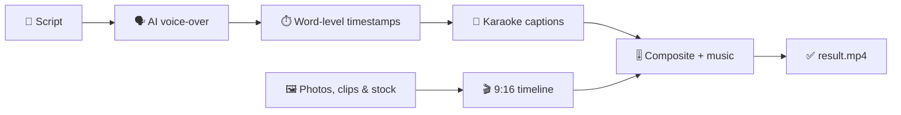

# Elisium 🎬

**Text in → ready-to-post video out.** Elisium is an automated video factory for short-form content: send it a script and a few photos or clips, and it returns a finished vertical video with an AI voice-over, word-by-word animated captions and a music bed — the format you see on TikTok, Instagram Reels and YouTube Shorts.

<p>
  
  
  
  
  
  
  
</p>

## What it does

One API call turns a script into a publish-ready MP4:

1. **AI voice-over** — the script is narrated by an ElevenLabs multilingual voice.
2. **Word-perfect caption timing** — the voice track is transcribed back with word-level timestamps (ElevenLabs Scribe), so every caption lands exactly when the word is spoken.
3. **Karaoke-style captions** — each word pops in as it's said and is highlighted in red while spoken, rendered in a bold outlined display font (Bebas Neue) — the caption style used by top short-form creators.
4. **Smart visuals** — uploaded photos and clips are blended with stock footage to cover the whole voice-over; media that doesn't fit the 9:16 frame gets a blurred fill background instead of black bars.
5. **Sound design** — a background track is auto-looped to the video length and ducked under the voice.
6. **Ready to post** — 1080×1920 (9:16), 30 fps, H.264/AAC MP4.



## Engineering highlights

- **A complete media pipeline in ~650 lines of Python**: text-to-speech → speech-to-text alignment → video compositing → caption animation → audio mixing → H.264 encoding.
- **Custom caption renderer** built on MoviePy: two timed layers per word (white base + red "now speaking" highlight), text measurement and word-wrap into a centered column.
- **OpenCV effects**: Gaussian-blurred fill backgrounds so media of any aspect ratio fills the vertical frame.
- **Defensive API design**: MIME-type allow-list, upload limits, script-length validation, one-render-at-a-time lock with `429 Busy`, JSON error responses, automatic cleanup of temp files after every request.
- **Containerized**: Dockerfile + docker-compose with ffmpeg baked into the image and media libraries mounted as volumes; includes an nginx config for relaying ElevenLabs API traffic through your own server.

## API

`POST /generate` — `multipart/form-data`

| Field | Description |
|---|---|
| `text` | Narration script, 35–200 words |
| image files | Up to 3 (`image/jpeg`, `image/png`) |
| video files | Up to 2 (`video/mp4`) |

Returns the finished MP4; responds `429` if a render is already in progress.

```bash
curl -X POST http://localhost:8080/generate \
  -F 'text=Your script goes here…' \
  -F 'photo=@photo.jpg;type=image/jpeg' \
  -F 'clip=@clip.mp4;type=video/mp4' \
  -o result.mp4
```

## Running

```bash
export ELEVEN_LABS_API_KEY=<your key>
./docker-start.sh   # builds the image and mounts the media libraries
```

Drop stock footage into `video/boxing/` and background tracks into `music/` — the generator picks from them at random. Voice model, clip length and script limits are tunable via `config.ini`. The pipeline is currently configured for Russian-language narration.

---

Built by [Maksim Panchuk](https://github.com/maxim-panchuk).
